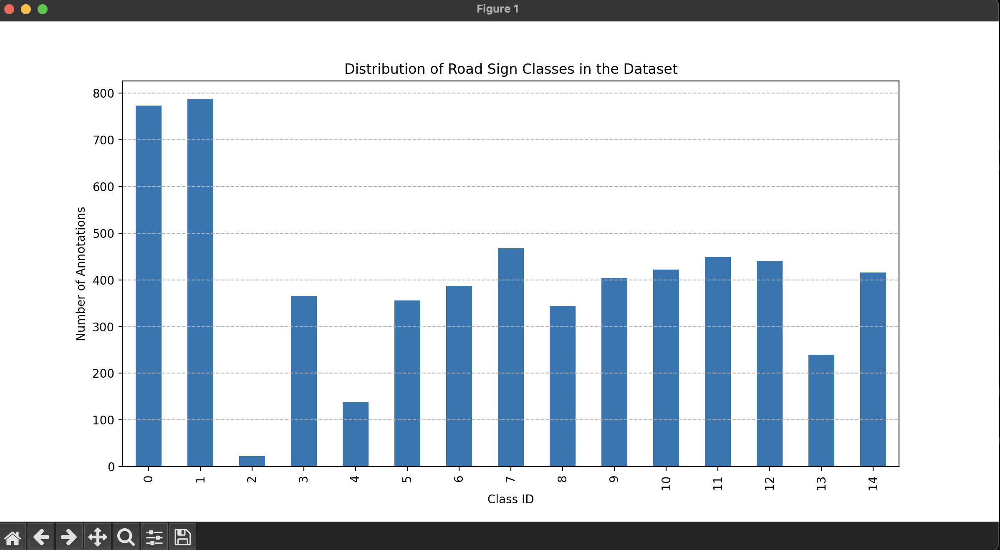
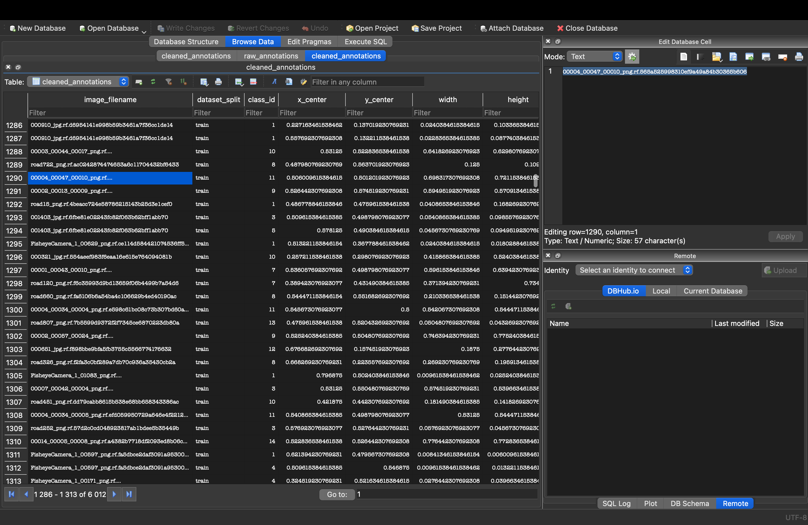

---

## Tutor2: Road Sign Data Cleaning and Standardization

This part of the project focuses on cleaning and preparing a real-world dataset of car and road sign annotations for a future analysis or machine learning project.

### Database Source

The dataset used is the "Traffic Signs Detection" dataset from Kaggle. It uses the **YOLO (You Only Look Once)** annotation format, where each image in the dataset has a corresponding `.txt` file. Each line in a `.txt` file contains the class ID and the normalized bounding box coordinates for a single detected object.

### Local Setup

1.  **Create a virtual environment and install dependencies:**
    It is recommended to create a `requirements.txt` file in your project root with the following content:

    ```
    pandas
    matplotlib
    Pillow
    ```

    Then, run the following commands:

    ```bash
    python -m venv venv
    source venv/bin/activate
    pip install -r requirements.txt
    ```

2.  **Create your configuration file:**

    - In the `scripts/` folder, create a file named `config.ini`.
    - Add the following content, adjusting the paths to match your local machine. The `dataset_root` should point to the folder containing the `train`, `test`, and `valid` subdirectories.
      ```ini
      [Paths]
      dataset_root = /path/on/your/machine/to/the/dataset/root/folder
      database_path = /path/on/your/machine/data/roadsigns.db
      ```

3.  **Run the scripts:**
    - First, run the main processing pipeline to create the clean database:
      ```bash
      python scripts/process_data.py
      ```
    - Then, you can optionally generate the showcase images:
      ```bash
      python scripts/visualize_data.py
      python scripts/showcase_bounding_box.py
      ```

## Project Showcase and Verification

The following images showcase the final output of the data processing pipeline.

### 1. Visualized Data Distribution

This chart, generated from the final cleaned database, shows the distribution of annotations across all class IDs. It provides a clear overview of the dataset's composition and balance, which is a crucial first step for any analysis or model training.



### 2. Cleaned Database Verification

This screenshot shows the `cleaned_annotations` table inside the final `roadsigns.db` file, as viewed in a database browser. It serves as direct proof that the script successfully:

- Loaded thousands of records.
- Cleaned the data (e.g., correct data types, no null values).
- Saved the results in a structured and accessible format.


