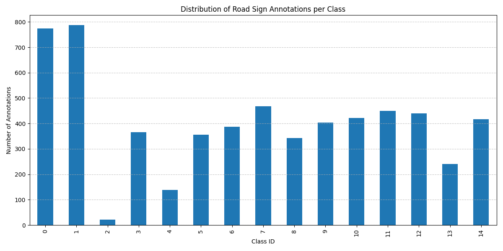

---

## Tutor2: Road Sign Data Cleaning and Standardization

This part of the project focuses on cleaning and preparing a dataset of road signs for a future analysis or machine learning project.

### Database Source

The dataset is a mock CSV (`raw_road_signs.csv`) representing data collected for road sign analysis. It includes columns for image paths, sign types, GPS coordinates, and recording dates.

### Local Setup

1.  **Create a virtual environment and install dependencies:**
    ```bash
    python -m venv venv
    source venv/bin/activate
    pip install pandas
    ```
2.  **Create your configuration file:**
    - In the `scripts/` folder, create a file named `config.ini`.
    - Add the following content, adjusting the paths to match your local machine:
      ```ini
      [Paths]
      raw_data_csv = /path/on/your/machine/data/raw_road_signs.csv
      database_path = /path/on/your/machine/data/roadsigns.db
      ```
3.  **Run the script:**
    ```bash
    python scripts/process_data.py
    ```

## Project Showcase and Verification

The following images showcase the final output of the data processing pipeline.

### 1. Visualized Data Distribution

This chart, generated from the final cleaned database, shows the distribution of annotations across all class IDs. It provides a clear overview of the dataset's composition and balance, which is a crucial first step for any analysis or model training.



### 2. Cleaned Database Verification

This screenshot shows the `cleaned_annotations` table inside the final `roadsigns.db` file, as viewed in a database browser. It serves as direct proof that the script successfully:

- Loaded thousands of records.
- Cleaned the data (e.g., correct data types, no null values).
- Saved the results in a structured and accessible format.


